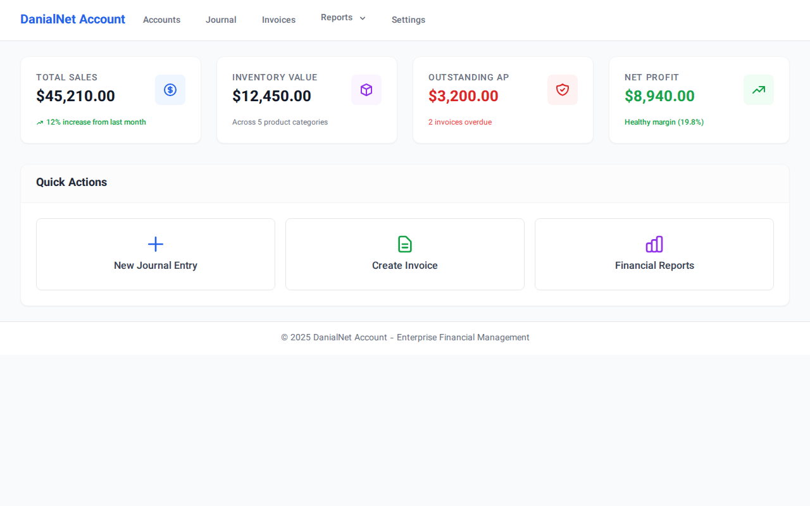
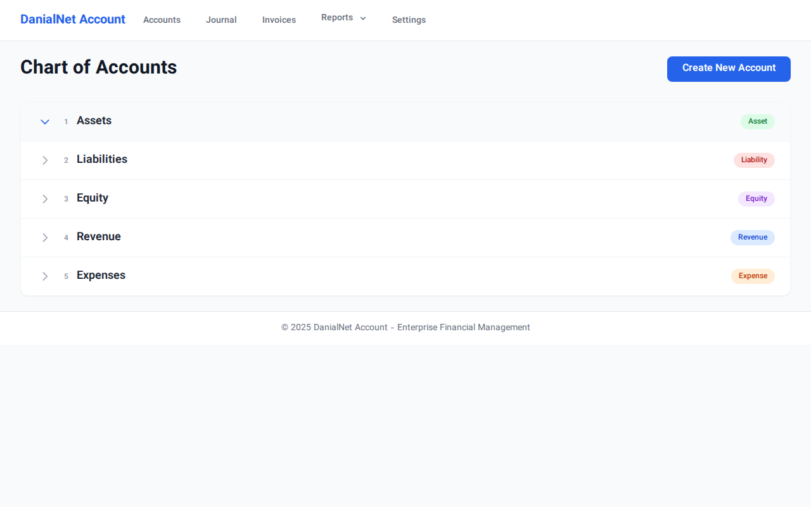
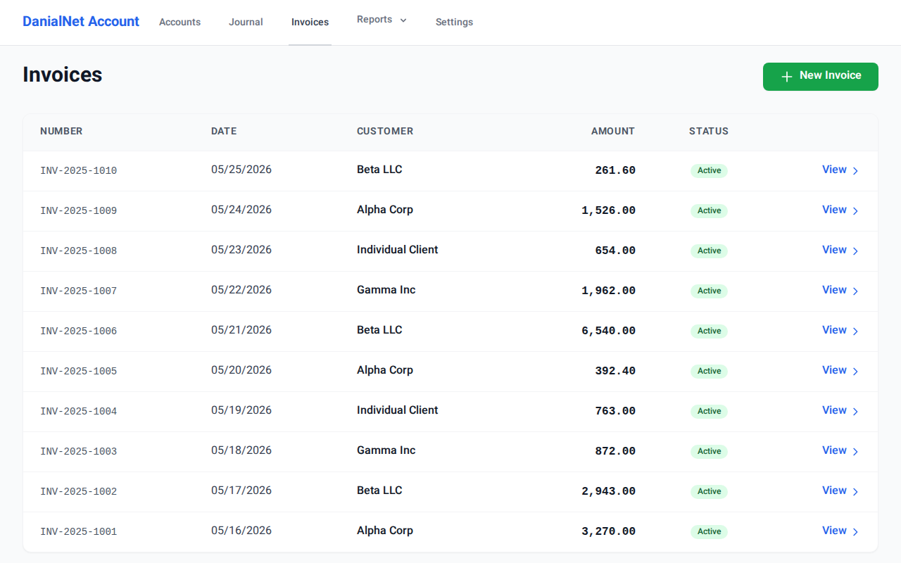
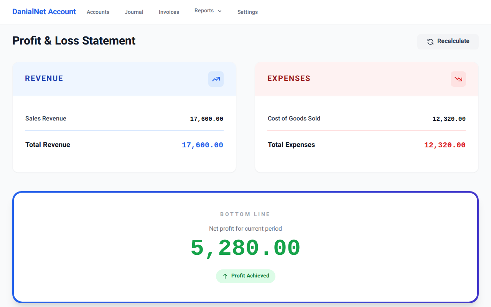

# DanialNet Account 🚀

**DanialNet Account** is a high-performance, enterprise-grade accounting and financial management system designed for Small and Medium Enterprises (SMEs). Built with **ASP.NET Core 8.0 MVC**, **Entity Framework Core**, and **Tailwind CSS**, it offers a robust solution for double-entry bookkeeping, inventory management, and financial reporting.

---

## ✨ Key Features

### 1. 📖 Double-Entry Ledger System
The heart of the system is a strict double-entry ledger. Every financial transaction is validated to ensure that **Total Debits = Total Credits**.
- **Dynamic Journaling**: Add multiple rows to a journal entry with real-time balance checking via JavaScript.
- **ACID Compliance**: Transactions are handled using database transactions to ensure data integrity.

### 2. 🌳 Hierarchical Chart of Accounts
Manage your accounts with a multi-level tree structure.
- **Self-Referencing Model**: Accounts can have parent-child relationships (e.g., Assets -> Current Assets -> Bank).
- **Interactive TreeView**: Explore your financial structure with a clean, collapsible interface.

### 3. 📦 Advanced Inventory Engine
A sophisticated engine to track stock levels and calculate costs.
- **Strategy Pattern**: Choose between **FIFO** (First-In-First-Out) or **Weighted Average** costing methods.
- **Negative Stock Protection**: The system prevents sales if inventory is insufficient, maintaining logic integrity.

### 4. 🧾 Dynamic Invoicing & Sales Integration
Streamlined sales workflow integrated with the ledger and inventory.
- **Real-time Tax & Totals**: Automatically calculates VAT (9%) and totals as you add items.
- **Automatic Posting**: Saving an invoice automatically reduces stock, records COGS, and updates the General Ledger.
- **Voiding Logic**: Properly reverse invoices with a single click, restoring stock and creating reversing journal entries.

### 5. 📊 Financial Intelligence Dashboard
Get instant insights into your company's health.
- **Real-time Reports**: Generate **Trial Balance**, **Profit & Loss**, and **Balance Sheet** statements.
- **IMemoryCache**: High-performance reporting using intelligent caching.
- **Account Ledger**: Drill down into any account to see a chronological list of transactions and a running balance.

---

## 🛠 Technical Implementation

### Architecture
- **MVC Pattern**: Clear separation of concerns between Models, Views, and Controllers.
- **Service Layer**: Business logic (Inventory, Reports, Localization) is encapsulated in dedicated service classes.
- **Tailwind CSS & Vazirmatn**: A modern, responsive UI built with a premium Iranian font face.
- **Multi-Language & Currency**: Full support for English/Persian (RTL) and USD/Toman.

### Folder Structure
- `Controllers/`: Handles user requests and orchestrates business flow.
- `Data/`: Contains `ApplicationDbContext` and `DbInitializer` for seeding.
- `Models/`: Core domain entities (Accounts, JournalEntries, Products, Invoices).
- `Services/`: Business logic services (Strategy Pattern for Inventory, Reporting logic, Localization).
- `ViewModels/`: Data transfer objects optimized for the Views.
- `Views/`: Razor-based UI templates styled with Tailwind CSS.

---

## 🚀 Quick Start

### Prerequisites
- .NET 8.0 SDK
- Docker (Optional)

### Run Locally
1. Clone the repository.
2. Run `dotnet run`.
3. Open `http://localhost:5000` (or the port specified in console).
4. The database will automatically be created and seeded with sample data.

### Run with Docker
```bash
docker-compose up --build
```

---

## 📸 System Previews

| Dashboard | Chart of Accounts |
|-----------|-------------------|
|  |  |

| Invoices | Profit & Loss |
|----------|---------------|
|  |  |

---

# دانیال‌نت اَکانت 🚀 (نسخه فارسی)

**دانیال‌نت اَکانت** یک سیستم حسابداری و مدیریت مالی در سطح اینترپرایز برای شرکت‌های کوچک و متوسط (SMEs) است. این نرم‌افزار با استفاده از تکنولوژی‌های روز مانند **ASP.NET Core 8.0 MVC**، **Entity Framework Core** و **Tailwind CSS** طراحی شده و راهکاری جامع برای حسابداری دوطرفه، مدیریت انبار و گزارش‌گیری مالی ارائه می‌دهد.

---

## ✨ ویژگی‌های کلیدی

### ۱. 📖 سیستم دفترداری دوطرفه
قلب تپنده سیستم، دفتر کل مبتنی بر حسابداری دوطرفه است. تمام تراکنش‌ها اعتبارسنجی می‌شوند تا همیشه **جمع بدهکار = جمع بستانکار** باشد.
- **ثبت سند داینامیک**: افزودن بی‌شمار ردیف به سند با محاسبه لحظه‌ای تراز توسط جاوااسکریپت.
- **رعایت اصول ACID**: استفاده از تراکنش‌های دیتابیس برای تضمین یکپارچگی داده‌های مالی.

### ۲. 🌳 ساختار درختی حساب‌ها (کدینگ)
مدیریت حساب‌ها در سطوح مختلف (گروه، کل، معین، تفصیلی).
- **مدل خوداراجعی**: قابلیت تعریف روابط والد-فرزندی برای حساب‌ها.
- **نمای درختی تعاملی**: رابط کاربری تمیز و قابلیت باز و بسته شدن گره‌های حساب.

### ۳. 📦 موتور پیشرفته انبارداری
سیستم هوشمند برای ردیابی موجودی و محاسبه بهای تمام شده.
- **الگوی استراتژی**: انتخاب بین روش‌های **FIFO** (اولین صادره از اولین وارده) یا **میانگین موزون**.
- **جلوگیری از موجودی منفی**: سیستم اجازه فروش کالایی که موجودی ندارد را نمی‌دهد.

### ۴. 🧾 صدور فاکتور و یکپارچگی فروش
فرآیند فروش متصل به دفتر کل و انبار.
- **محاسبه لحظه‌ای مالیات**: محاسبه خودکار مالیات بر ارزش افزوده (۹٪) و جمع فاکتور.
- **ثبت خودکار اسناد**: با ذخیره فاکتور، موجودی انبار کسر، بهای تمام شده محاسبه و سند حسابداری مربوطه صادر می‌شود.
- **قابلیت ابطال (Void)**: ابطال فاکتور با یک کلیک، بازگرداندن کالا به انبار و صدور سند معکوس.

### ۵. 📊 داشبورد هوش مالی
دسترسی لحظه‌ای به وضعیت سلامت شرکت.
- **گزارشات واقعی**: تراز آزمایشی، سود و زیان، و ترازنامه.
- **استفاده از کش (IMemoryCache)**: سرعت بسیار بالا در لود گزارشات سنگین.
- **دفتر معین حساب**: مشاهده گردش عملیات و مانده جاری برای هر حساب به صورت مجزا.

---

## 🛠 پیاده‌سازی فنی

### معماری
- **الگوی MVC**: جداسازی دقیق لایه‌های داده، نمایش و کنترلر.
- **لایه سرویس**: کپسوله‌سازی منطق بیزینسی (انبار، گزارشات، بومی‌سازی).
- **Tailwind CSS و فونت وزیر**: رابط کاربری مدرن، ریسپانسیو و بهینه شده برای زبان فارسی (RTL).
- **پشتیبانی از چند زبانی و ارز**: پشتیبانی کامل از انگلیسی/فارسی و دلار/تومان.

---

## 🚀 راه اندازی سریع

### پیش‌نیازها
- .NET 8.0 SDK
- Docker (اختیاری)

### اجرای محلی
1. پروژه را کلون کنید.
2. دستور `dotnet run` را اجرا کنید.
3. آدرس `http://localhost:5000` را باز کنید.
4. دیتابیس به صورت خودکار ساخته و با داده‌های اولیه نمونه پر می‌شود.

### اجرا با داکر
```bash
docker-compose up --build
```

---
توسعه یافته با ❤️ توسط تیم دانیال‌نت.
