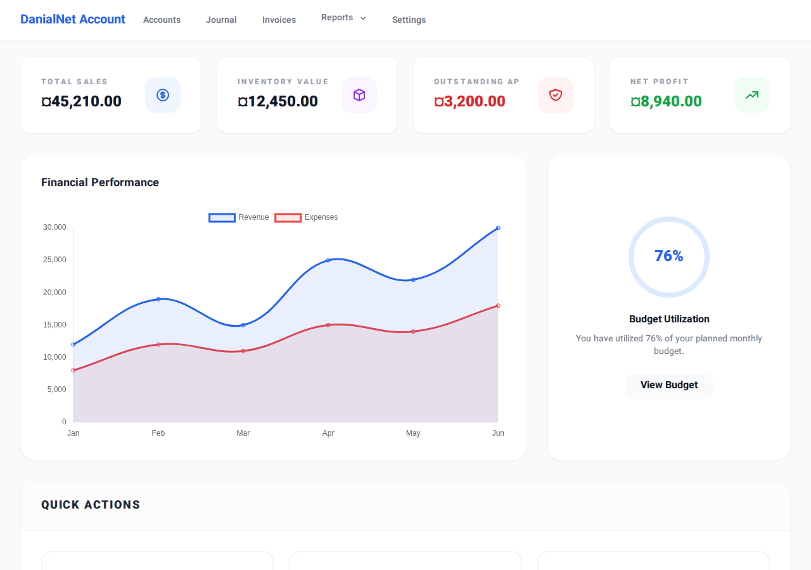
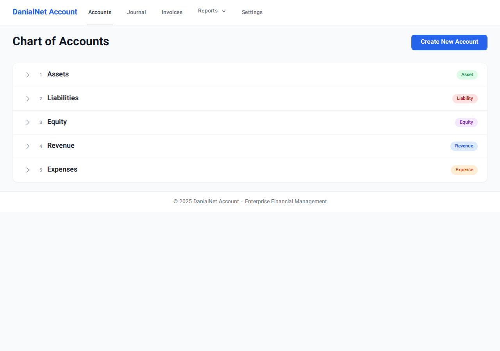
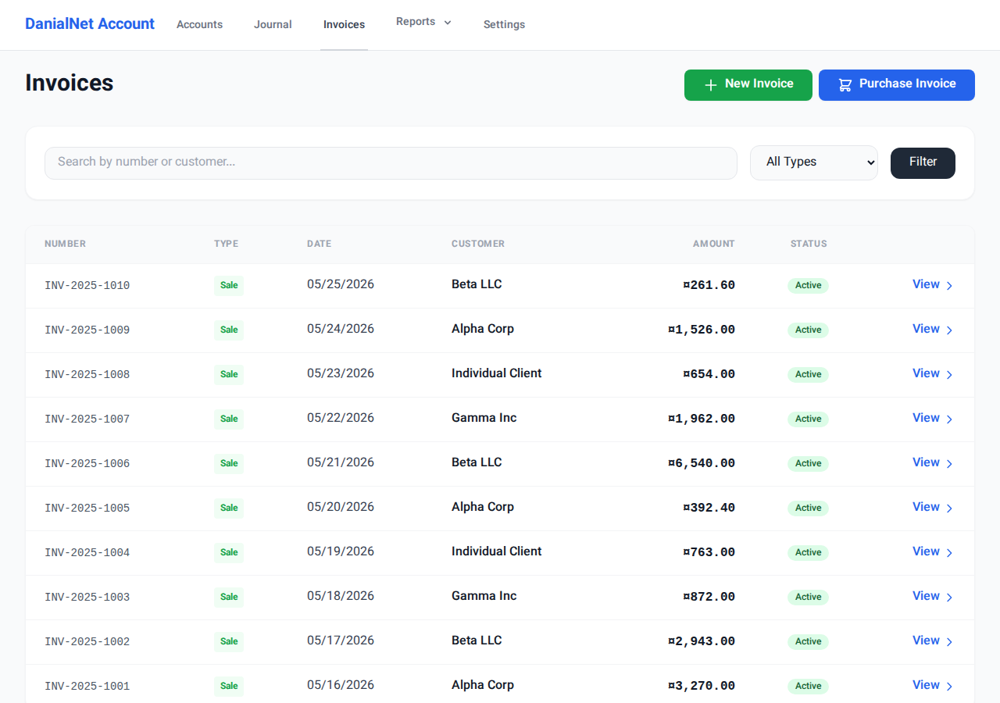
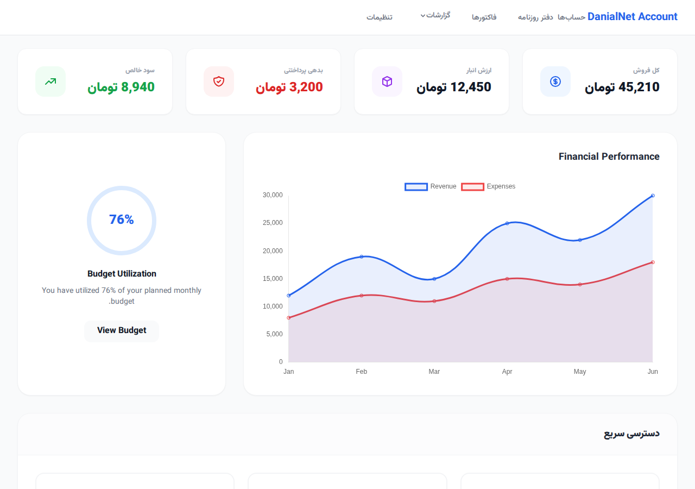
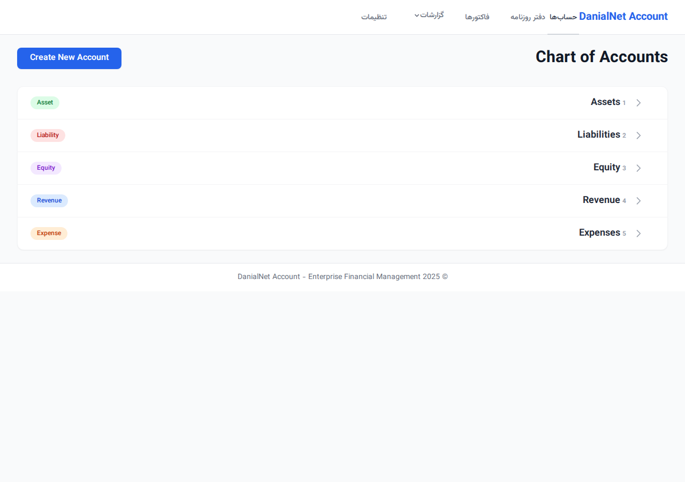
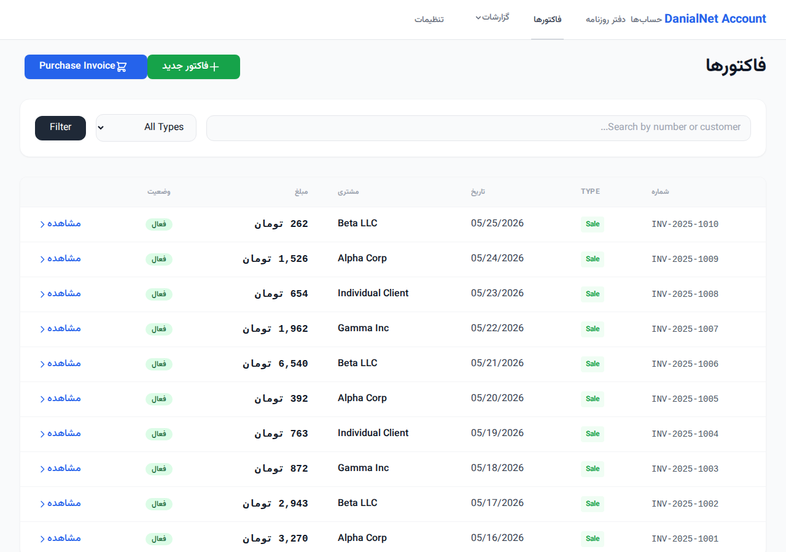

# DanialNet Account 🚀

**DanialNet Account** is a high-performance, enterprise-grade accounting and financial management system designed for Small and Medium Enterprises (SMEs). Built with **ASP.NET Core 8.0 MVC**, **Entity Framework Core**, and **Tailwind CSS**, it offers a robust solution for double-entry bookkeeping, inventory management, and financial reporting.

---

## ✨ Key Features

### 1. 📖 Double-Entry Ledger System
The heart of the system is a strict double-entry ledger. Every financial transaction is validated to ensure that **Total Debits = Total Credits**.
- **Dynamic Journaling**: Add multiple rows to a journal entry with real-time balance checking via JavaScript.
- **ACID Compliance**: Transactions are handled using database transactions to ensure data integrity.

### 2. 🌳 Hierarchical Chart of Accounts
Manage your accounts with a multi-level tree structure.
- **Self-Referencing Model**: Accounts can have parent-child relationships (e.g., Assets -> Current Assets -> Bank).
- **Interactive TreeView**: Explore your financial structure with a clean, collapsible interface.

### 3. 📦 Advanced Inventory Engine
A sophisticated engine to track stock levels and calculate costs.
- **Strategy Pattern**: Choose between **FIFO** (First-In-First-Out) or **Weighted Average** costing methods.
- **Negative Stock Protection**: The system prevents sales if inventory is insufficient, maintaining logic integrity.

### 4. 🧾 Dynamic Invoicing & Integrated Sales/Purchases
Streamlined workflow for both Sales and Purchase invoices.
- **Purchase Invoices**: Seamlessly increase inventory and update Accounts Payable/Bank.
- **Real-time Tax & Totals**: Automatically calculates VAT (9%) and totals.
- **Automatic Posting**: Saving an invoice automatically records COGS and updates the General Ledger.

### 5. 📊 Financial Intelligence Dashboard
Get instant insights into your company's health.
- **Visual Analytics**: Interactive charts showing revenue and expense trends.
- **Real-time Reports**: Generate **Trial Balance**, **Profit & Loss**, and **Balance Sheet** statements.
- **Account Ledger**: Drill down into any account to see chronological transaction history.

---

## 🛠 Technical Implementation

### Architecture
- **MVC Pattern**: Clear separation between Models, Views, and Controllers.
- **Service Layer**: Business logic (Inventory, Reports, Localization) in dedicated services.
- **Tailwind CSS & Vazirmatn**: Modern, responsive UI with premium Iranian typography.
- **Multi-Language & Currency**: Dynamic RTL/LTR support for English/Persian and USD/Toman.

### Folder Structure
- `Controllers/`: User request orchestration.
- `Data/`: DB Context and complex seeding logic.
- `Models/`: Core domain entities.
- `Services/`: Strategy patterns and specialized logic.
- `Views/`: Tailwind-styled Razor templates.

---

## 🚀 Quick Start

### Run Locally
1. Clone the repository.
2. Run `dotnet run`.
3. Open `http://localhost:5000`.

### Run with Docker
```bash
docker-compose up --build
```

---

## 📸 System Previews (English)

| Dashboard | Chart of Accounts | Invoices |
|-----------|-------------------|----------|
|  |  |  |

---

# دانیال‌نت اَکانت 🚀 (نسخه فارسی)

**دانیال‌نت اَکانت** یک سیستم حسابداری و مدیریت مالی در سطح اینترپرایز برای شرکت‌های کوچک و متوسط (SMEs) است. این نرم‌افزار با استفاده از تکنولوژی‌های روز طراحی شده و راهکاری جامع برای حسابداری دوطرفه، مدیریت انبار و گزارش‌گیری مالی ارائه می‌دهد.

---

## ✨ ویژگی‌های کلیدی

### ۱. 📖 سیستم دفترداری دوطرفه
قلب تپنده سیستم، دفتر کل مبتنی بر حسابداری دوطرفه است. تمام تراکنش‌ها اعتبارسنجی می‌شوند تا همیشه **جمع بدهکار = جمع بستانکار** باشد.
- **ثبت سند داینامیک**: افزودن بی‌شمار ردیف به سند با محاسبه لحظه‌ای تراز توسط جاوااسکریپت.

### ۲. 🌳 ساختار درختی حساب‌ها (کدینگ)
مدیریت حساب‌ها در سطوح مختلف با قابلیت تعریف روابط والد-فرزندی و نمای درختی تعاملی.

### ۳. 📦 موتور پیشرفته انبارداری
ردیابی هوشمند موجودی با استفاده از الگوهای **FIFO** و **میانگین موزون**. همراه با سیستم جلوگیری از موجودی منفی.

### ۴. 🧾 صدور فاکتور و یکپارچگی خرید/فروش
فرآیند فروش و خرید متصل به دفتر کل و انبار.
- **فاکتور خرید**: افزایش خودکار موجودی و ثبت سند بدهی/بانک.
- **ثبت خودکار اسناد**: محاسبه لحظه‌ای بهای تمام شده و مالیات (۹٪).

### ۵. 📊 داشبورد هوش مالی
نمایش نمودارهای تحلیلی و گزارشات واقعی (تراز آزمایشی، سود و زیان، ترازنامه) با سرعت بالا.

---

## 📸 پیش‌نمایش سیستم (فارسی)

| داشبورد مدیریتی | ساختار حساب‌ها | مدیریت فاکتورها |
|-----------|-------------------|----------|
|  |  |  |

---
توسعه یافته با ❤️
